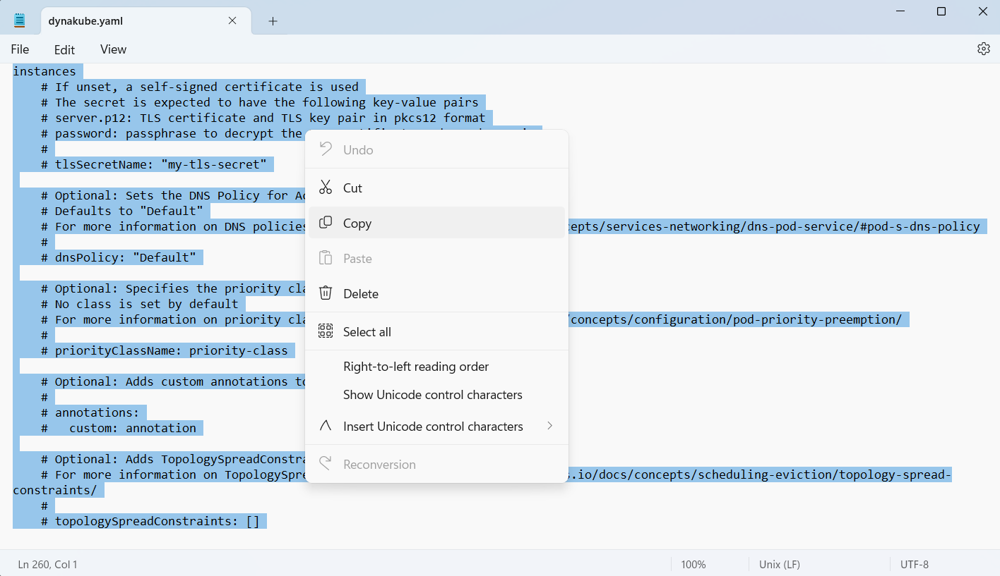
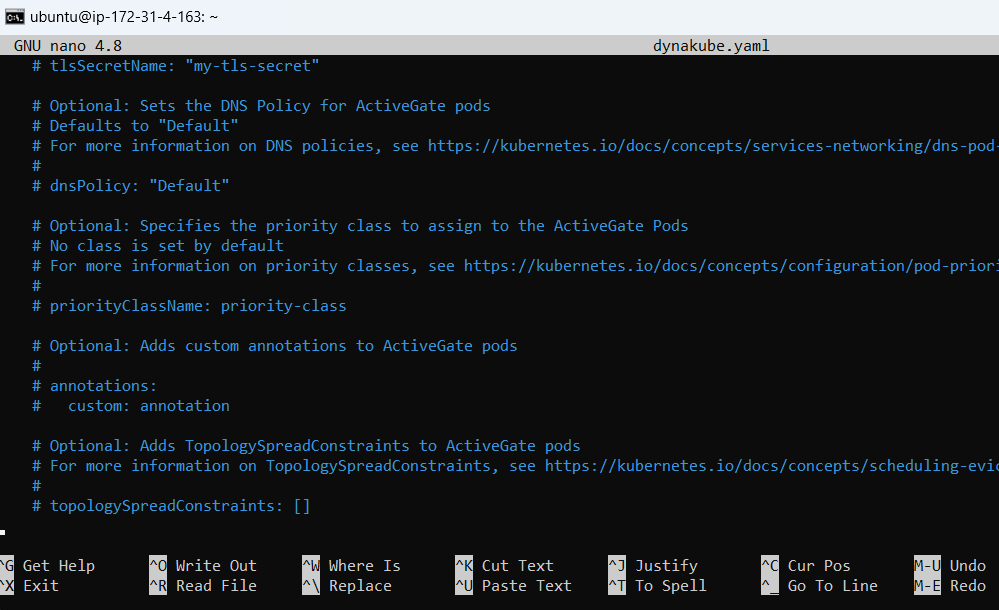
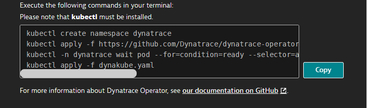
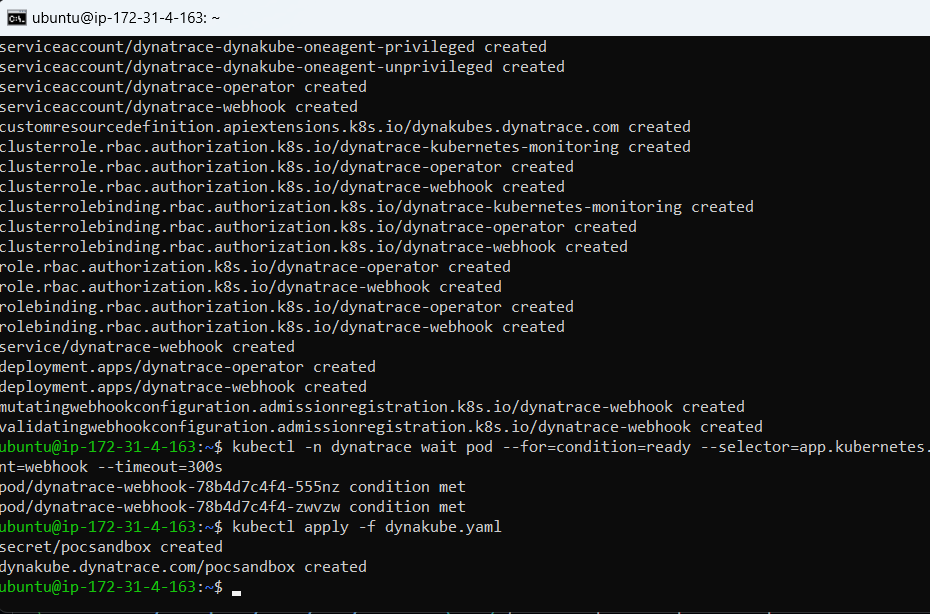
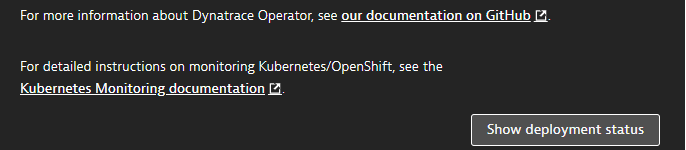
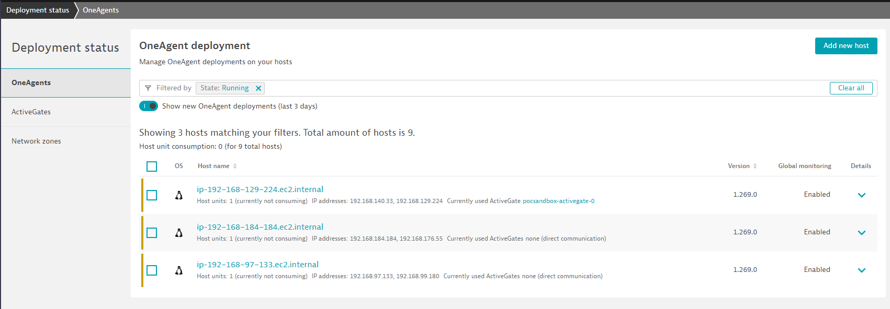
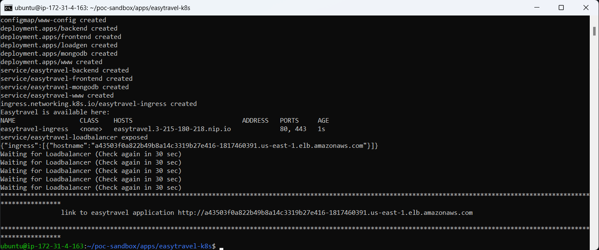
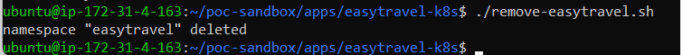

summary: POC Sandbox
id: danatrace.github.io
categories: Sandbox, EKS, 
tags: POC-Sandbox
status: Published
authors: daniel.braaf

## Welcome to the POC Sandbox
Duration: 1

Welcome to the Dynatrace POC-Sandbox.
The POC-Sandbox is a hands on environment meant to demonstrate the ease of use of the Dynatrace Platform. 


## Connect to POC-Sandbox Shell Instance

#### Download the key-pair file that is attached to the Sandbox creation completion email

<table style="width:100%;">
  <tr>
  <td><br><br></td>
  </tr>
</table>


#### Save the keyfile to a folder of your choice

<br>
<table style="width:100%;">
  <tr>
 <td><br><br></td>
  </tr>
</table>
<br>


#### Copy the ssh command from the Sandbox creation completion email

<table style="width:100%;">
  <tr>
 <td><br><br></td>
  </tr>
</table>

#### Open a Command Line prompt and access the directory where the key was downloaded
#### Paste the ssh command from the Sandbox creation completion email
```bash
C:\Users\user\Downloads> ssh -i {yourpemkeyname}.pem ubuntu@{yourinstancedns}.com
```

#### You have successfully connected to the shell instance with access to your POC-Sanbdox Cluster

<table style="width:100%;">
  <tr>
 <td><br><br></td>
  </tr>
</table>

## Connect shell instance to POC-Sanbox Kubernetes Cluster


#### Copy the 2nd commands from the Sandbox creation completion email

<table style="width:100%;">
  <tr>
 <td><br><br></td>
  </tr>
</table>

#### Paste the second command into your shell instance
```bash
aws eks --region us-east-1 update-kubeconfig --name {your-tenant-id}-sandbox
```

#### Test if the connection was successful with the following command 
```bash
kubectl get namespaces
```

#### Your output should look like this

```bash
NAME              STATUS   AGE
default           Active   5h8m
kube-node-lease   Active   5h8m
kube-public       Active   5h8m
kube-system       Active   5h8m
```

## Connect Dynatrace with the Kubernetes cluster

#### In the Dynatrace UI Navigate to Deploy Agent -> Kuberentes

<table style="width:100%;">
  <tr>
 <td><br><br></td>
  </tr>
</table>

#### Provide a name (for example pocsandbox)
#### Click the 2 "Create Token" buttons 
#### and then the Download dynakube.yaml button

<table style="width:100%;">
  <tr>
 <td><br><br></td>
  </tr>
</table>

#### Copy the content of downloaded the dynakube.yaml

<table style="width:100%;">
  <tr>
 <td><br><br></td>
  </tr>
</table>

#### Go back to the Shell Instance, create a new file with the name dynakube.yaml

```bash
nano dynakube.yaml
```

#### Copy the content of the downloaded dynakube.yaml into the newly created dynakube.yaml in the shell instance and save the file

<table style="width:100%;">
  <tr>
 <td><br><br></td>
  </tr>
</table>

#### Copy the command section from the Install Dynatrace overview

<table style="width:100%;">
  <tr>
 <td><br><br></td>
  </tr>
</table>

#### Paste and execute the copied commands into the shell instance

```bash
kubectl create namespace dynatrace
kubectl apply -f https://github.com/Dynatrace/dynatrace-operator/releases/download/v0.11.1/kubernetes.yaml
kubectl -n dynatrace wait pod --for=condition=ready --selector=app.kubernetes.io/name=dynatrace-operator,app.kubernetes.io/component=webhook --timeout=300s
kubectl apply -f dynakube.yaml
```

#### You should get the following result in the shell instance

<table style="width:100%;">
  <tr>
 <td><br><br></td>
  </tr>
</table>

#### Click on "Show deployment Status" in the Install Kubernetes overview in Dynatrace

<table style="width:100%;">
  <tr>
 <td><br><br></td>
  </tr>
</table>

#### The Agents will be displayed as soon as they make a connection

<table style="width:100%;">
  <tr>
 <td><br><br></td>
  </tr>
</table>

## Deploy Easytravel to Kubernetes Cluster

#### In the shell instance cd into the directory 

```bash
cd /home/ubuntu/poc-sandbox/apps/easytravel-k8s
```

#### Execute the file deploy_easytravel.sh file and wait until the script has completed
```bash
~/poc-sandbox/apps/easytravel-k8s$ ./deploy-easytravel.sh
```

#### When the script has completed it will output the url the loadbalancer url

<table style="width:100%;">
  <tr>
 <td><br><br></td>
  </tr>
</table>

#### Copy the Loadbalancer url and paste it into your browser

<table style="width:100%;">
  <tr>
 <td><br><br></td>
  </tr>
</table>

#### you have successfully deployed the easytravel app 

#### to remove the easytravel app and loadbalancer execute the remove-easytravel.sh
```bash
~/poc-sandbox/apps/easytravel-k8s$ ./remove-easytravel.sh
```

#### this is the expected output after removal of the easytravel application

<table style="width:100%;">
  <tr>
 <td><br><br></td>
  </tr>
</table>