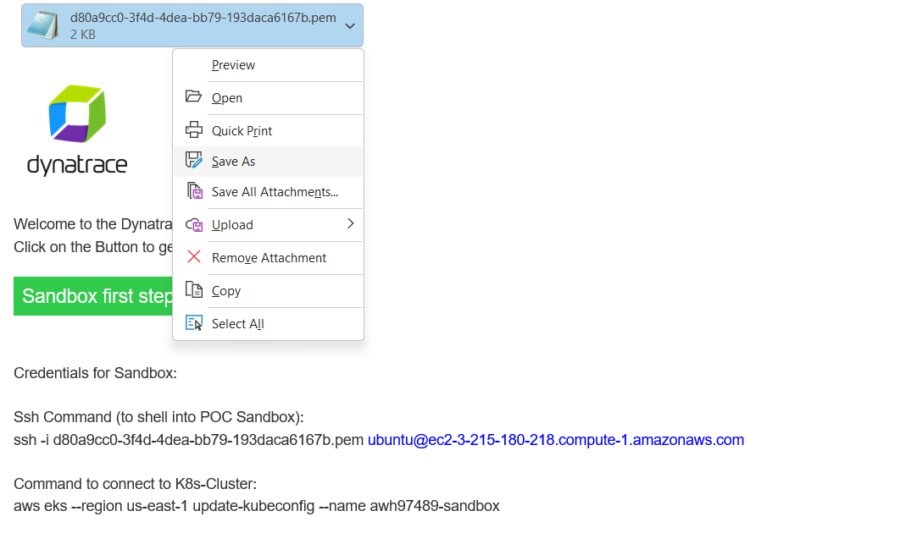
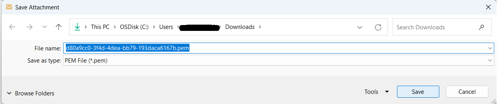
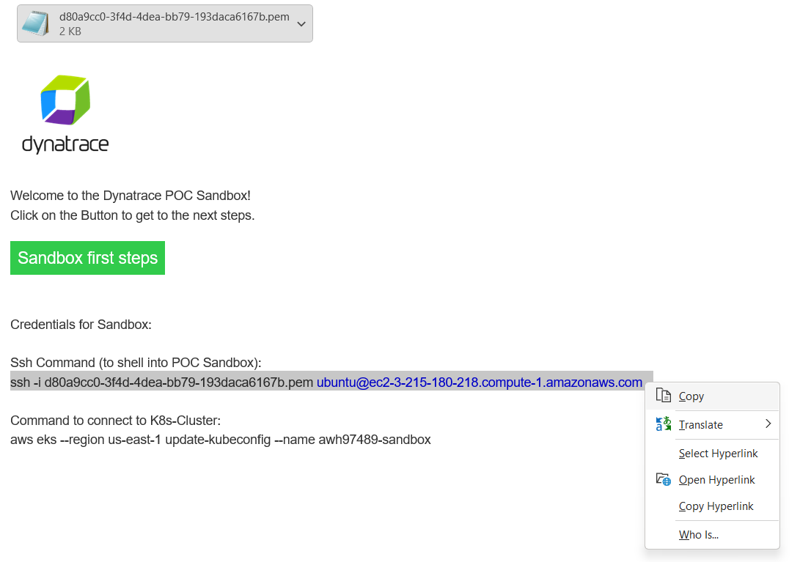
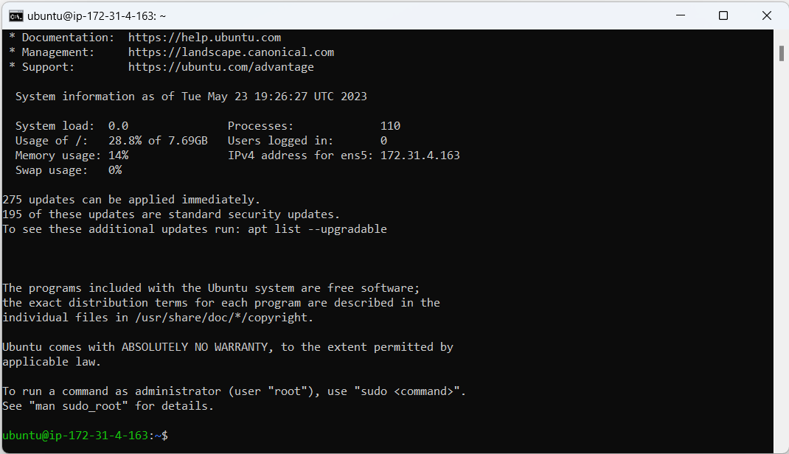
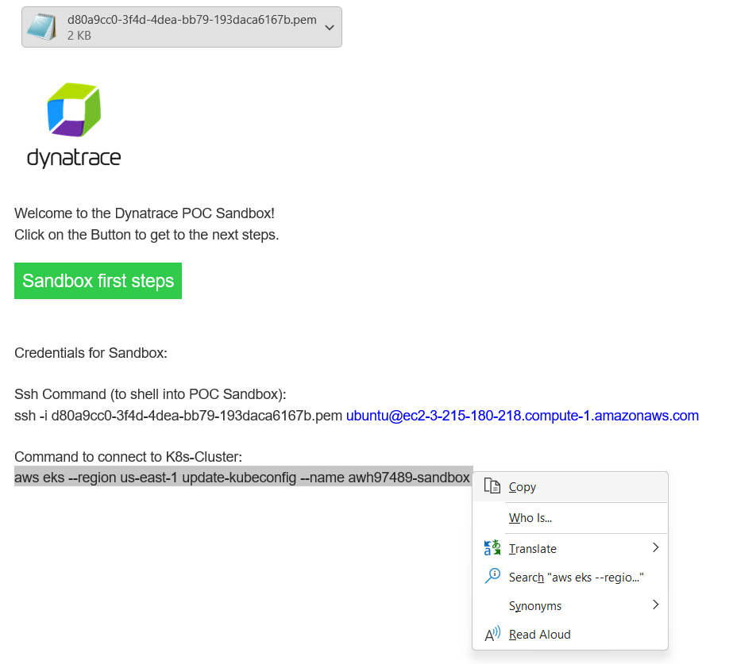
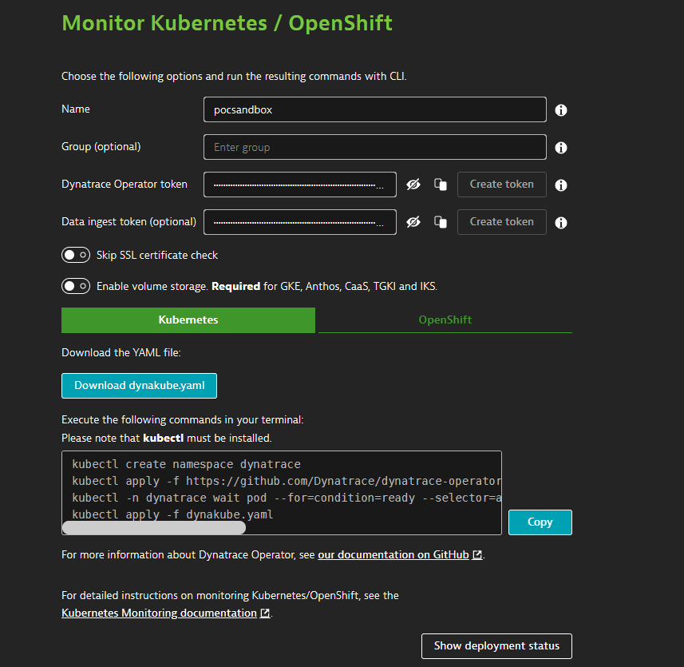
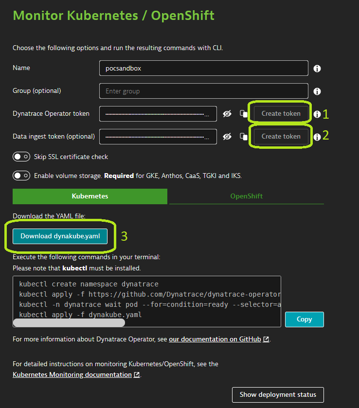

summary: POC Sandbox
id: danatrace.github.io
categories: Sandbox, EKS, 
tags: POC-Sandbox
status: Published
authors: daniel.braaf

## Welcome to the POC Sandbox
Duration: 1

Welcome to the Dynatrace POC-Sandbox.
The POC-Sandbox is a hands on environment meant to demonstrate the ease of use of the Dynatrace Platform. 


## Connect to POC-Sandbox Shell Instance

#### Download the key-pair file that is attached to the Sandbox creation completion email

<table style="width:100%;">
  <tr>
  <td><br><br></td>
  </tr>
</table>


#### Save the keyfile to a folder of your choice

<br>
<table style="width:100%;">
  <tr>
 <td><br><br></td>
  </tr>
</table>
<br>


#### Copy the ssh command from the Sandbox creation completion email

<table style="width:100%;">
  <tr>
 <td><br><br></td>
  </tr>
</table>

#### Open a Command Line prompt and access the directory where the key was downloaded
#### Paste the ssh command from the Sandbox creation completion email
```bash
C:\Users\user\Downloads> ssh -i {yourpemkeyname}.pem ubuntu@{yourinstancedns}.com
```

#### You have successfully connected to the shell instance with access to your POC-Sanbdox Cluster

<table style="width:100%;">
  <tr>
 <td><br><br></td>
  </tr>
</table>

## Connect shell instance to POC-Sanbox Kubernetes Cluster


#### Copy the 2nd commands from the Sandbox creation completion email

<table style="width:100%;">
  <tr>
 <td><br><br></td>
  </tr>
</table>

#### Paste the second command into your shell instance
```bash
aws eks --region us-east-1 update-kubeconfig --name {your-tenant-id}-sandbox
```

#### Test if the connection was successful with the following command 
```bash
kubectl get namespaces
```

#### Your output should look like this

```bash
NAME              STATUS   AGE
default           Active   5h8m
kube-node-lease   Active   5h8m
kube-public       Active   5h8m
kube-system       Active   5h8m
```

## Connect Dynatrace with the Kubernetes cluster

#### In the Dynatrace UI Navigate to Deploy Agent -> Kuberentes

<table style="width:100%;">
  <tr>
 <td><br><br></td>
  </tr>
</table>

#### Provide a name (for example pocsandbox), click the 2 "Create Token" buttons and then the Download dynakube.yaml button

<table style="width:100%;">
  <tr>
 <td><br><br></td>
  </tr>
</table>